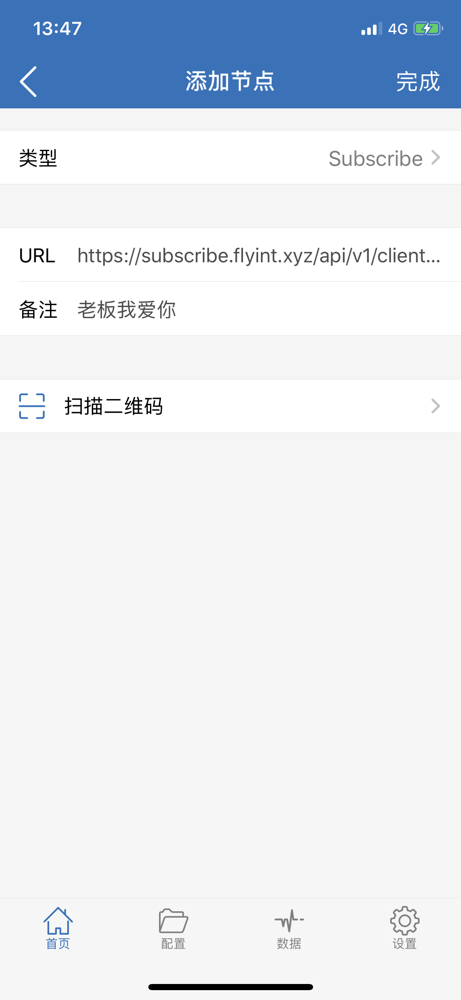
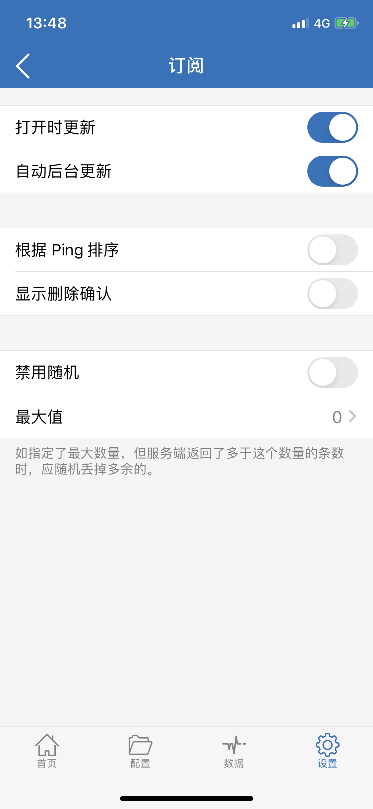
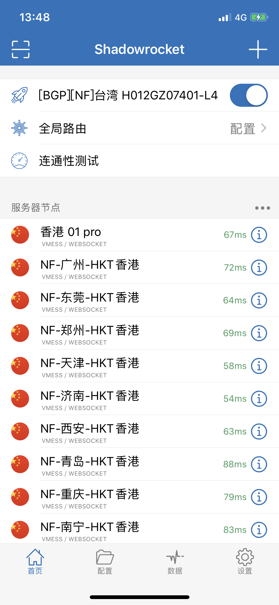
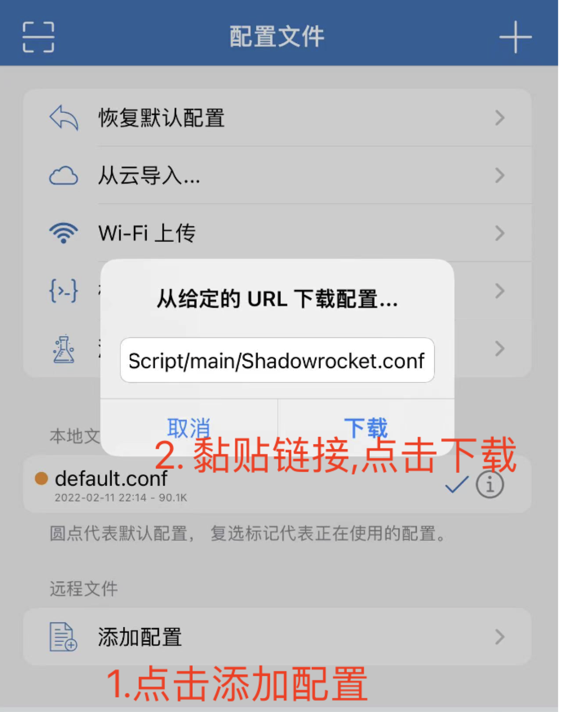

# Shadowrocket


**使用此软件前** **, 需已查看**[**必备确认**](../faq/errorfaq.md)****



**传输加密依赖于您的设备系统时间，请确保使用的系统时间与北京时间同步(只要年月日时分与北京时间同步即可)**


**订阅链接不是配置文件,不要导入配置里面！**

**订阅链接不是配置文件,不要导入配置里面！**

**订阅链接不是配置文件,不要导入配置里面！**

## 获取 Shadowrocket

(此应用中文俗称“ 小火箭 ”，App Store内存在较多高仿版，请注意应用名称与开发者名称)\
&#x20;由于境内地区 禁止代理应用因此已被下架，当前需要在境外地区的 App Store 获取\
&#x20;因此需要境外 Apple ID 方可获取下载，应用售价 $2.99 （该费用收取方为程序开发者）

第三方购买渠道

你买的,就是属于你自己的, 不需要注意其它东西

****[**美区Shadowrocket**](https://www.az200.icu/product/3.html)****

## 退出你原来的App Store账户 并使用我们提供的下载

打开appstore > 点击头像 > 拉到最下面，点击退出登录\
打开appstore登录在本站复制的Apple 账号和密码

**登录后需要关闭并重新打开 App Store 否则还是显示你原来的账户**

**打开 App Store 搜索** shadowrocket 并下载

.png>)

## 导入订阅链接

**订阅链接不是配置文件,不要导入配置里面！**

**订阅链接不是配置文件,不要导入配置里面！**

**订阅链接不是配置文件,不要导入配置里面！**

**自动导入**

**登录网站 -> 仪表盘 -> 一键订阅 -> 导入到Shadowrocket**

如未自动唤起Shadowrocket 请使用手动导入。

## 手动导入订阅地址 <a href="#manual-operation" id="manual-operation"></a>

**登录网站 -> 仪表盘 -> 一键订阅 -> 复制订阅地址**

打开 Shadowrocket 点击右上角的 + 号 添加配置，类型选择「Subscribe」，然后 URL 处粘贴你复制的订阅链接，备注随意填写，点击完成。



在 「设置]」- 「服务器订阅」开启 「打开时更新」「自动后台更新」。



如果一切正常那么在APP首页就应该会显示出节点了，这时候就可以选择节点和启用使用了。



## 更新订阅

.png>)

## Shadowrocket进阶玩法

1\. 配置模式下Shadowrocket根据配置文件决定哪些网站会使用vpn访问。

2.默认的配置文件可能不太完善, 所以推荐使用下面这个配置文件

```
https://raw.githubusercontent.com/Tartarus2014/Shadowrocket-Script/main/Shadowrocket.conf
```

复制上述链接并导入至shadowrocket配置内



.png>)
