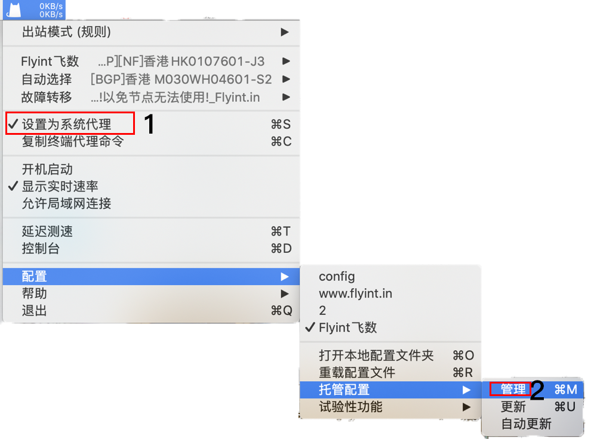
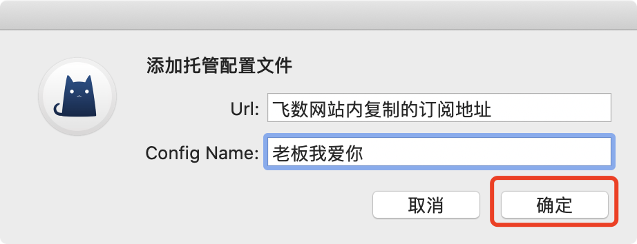
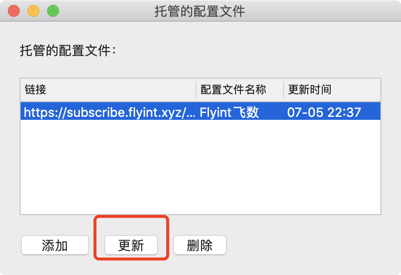
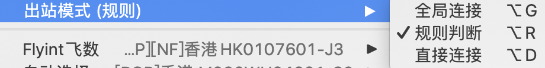

# ClashX

## 下载安装

****[**点我下载** ](https://downloads.goglon.com/downloads/ClashX.dmg)****

下载完成后安装运行

请耐心等待。

## 安装

部分MAC会提示『未知开发者来源APP』等类似提示，导致无法安装。

请打开『允许任何来源』。方可进行安装

如你的MAC 『安全性与隐私』-『通用』内没有 『任何来源』选项，[请看这个开启的教程](https://jingyan.baidu.com/article/6079ad0eb99aa228ff86db0a.html)。

.png>)

安装clashx

首次使用会提醒你应用来自未知开发者，选择允许打开此应用。

ClashX 首次运行会提示是否安装帮助程序。此帮助程序用于设置系统代理，否则每次你通过 ClashX 变更系统状态（打开或关闭）时都需要输入密码，点击 **「Install」** ，之后mac OS会提示输入用户密码。

## 添加订阅

### **一键导入**

**登录网站 -> 仪表盘 -> 一键订阅+ -> 导入到ClashX**

飞数支持一键自动导入ClashX, 如未自动唤醒ClashX并自动导入，请手动导入。

### **手动导入**

**登录网站 -> 仪表盘  -> 一键订阅+ -> 复制订阅地址**

1.设置为系统代理     2.打开托管配置 - >管理

添加订阅地址

&#x20; **!!!!!更新订阅 请务必经常执行这一步! 及时获取同步最新节点信息!!!!**

选择代理模式

选择节点即可使用

.png>)

## 如何更新订阅

请务必经常更新订阅,获取最新节点配置

1. 不要勾选"设置为系统代理"
2. 点击'配置' -> '托管配置' -> '更新'

