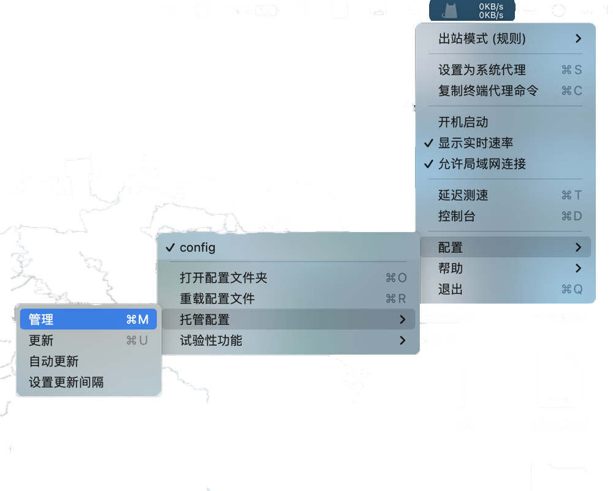
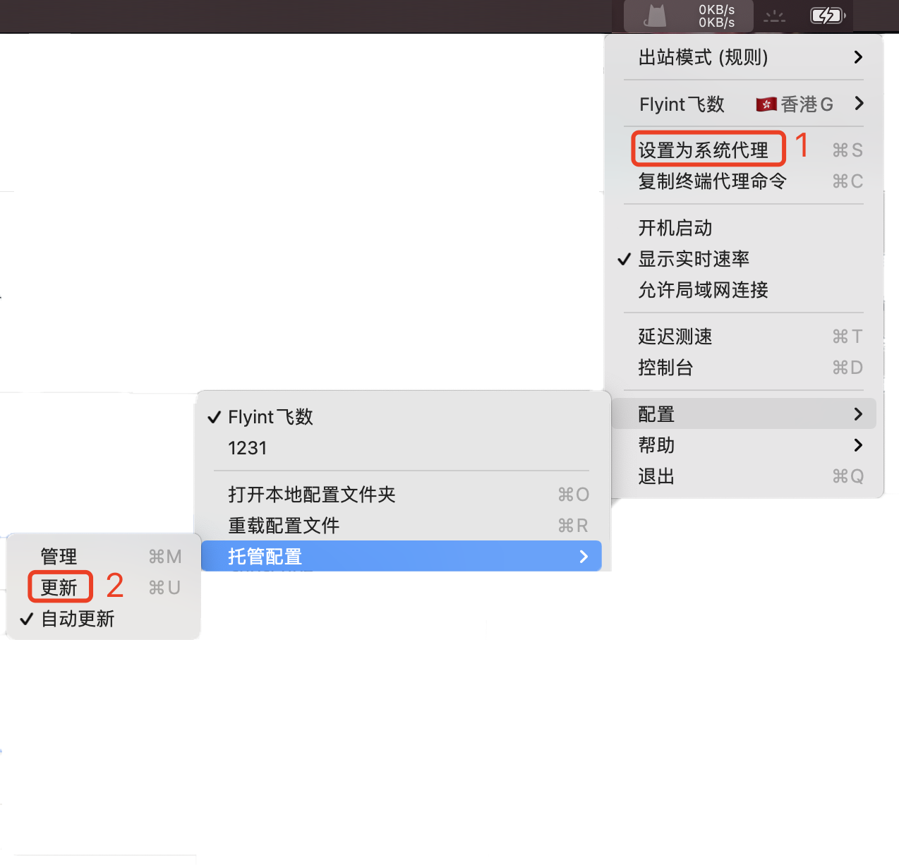

# 👍 ClashX

## 1.下载安装

1. ****[**点我下载** ](https://downloads.goglon.com/downloads/ClashX.dmg)****
2. &#x20;**安装**

如提示 "未知开发者来源APP" 等类似提示, 请打开 "允许任何来源" 。方可进行安装

如你的MAC  "安全性与隐私" -"通用" 内没有 "任何来源" 选项，[请看这个开启的教程](https://jingyan.baidu.com/article/6079ad0eb99aa228ff86db0a.html)。

 (1).png>)

ClashX会安装Clashx Helper程序, 请允许并安装!

**3. 打开Clashx**

注意:  Clashx打开后要从状态栏进行界面操作. 如未显示(被遮挡住了), 请关闭退出其它应用.

.png>)

## 2.导入订阅链接

### **(1.一键导入**

在仪表盘->订阅地址->导入到clashx 即可自动拉起程序自动导入

 (1).png>)

如果一键导入不好使, 请使用下方手动导入👇🏻

### **(2.手动导入**

&#x20;在仪表盘->订阅地址->复制订阅地址

.png>)

2-1: 关闭设置为系统代理, 出站模式选择规则

点击 配置->托管配置->管理

2-2: 添加订阅地址

****.png>)****

****

### 3.开始使用

设置为系统代理 **:**  软件的开关.  ****  打钩就是开, 不打钩就关.

.png>)

3-1: 出站模式介绍:

全局连接:  无论国内外网站, 全部使用此软件加速访问. 缺点: 国内网站会变很慢或者无法访问.

规则判断: 国内网站使用自己本地宽带, 国外网站使用此软件加速访问. **平时用这个**

直接连接: 我也不知道是啥玩意, 反正这个不能加速.

## 如何更新订阅

请务必经常更新订阅,获取最新节点配置

1. 不要勾选"设置为系统代理"
2. 点击'配置' -> '托管配置' -> '更新'

