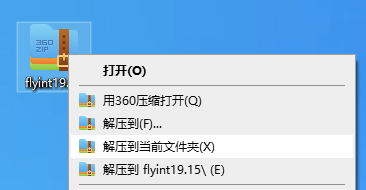
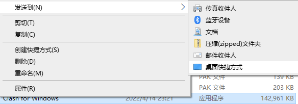

# 👍 Clash for Windows

由于我们开发的客户端软件~~技术太菜~~十分不好用, 我自己都不想用.所以写此教程.&#x20;

此软件是第三方公共开发软件, 非常好用. Nice.

如遇问题,请随时联系客服,切记详细描述问题,&#x20;

对于初次使用用户,可能有点不熟悉软件操作, 请您多花几分钟仔细根据教程操作.&#x20;

## 1.下载安装 

1. ****[**点此下载软件**](https://downloads.goglon.com/downloads/flyint19.15.7z)****
2. **解压.** 如没有安装解压缩软件,请[下载安装360压缩](http://down.360safe.com/360zip\_setup\_4.0.0.1390.exe)

********

****

**3.发送到桌面快捷方式,方便下次使用**

********

****

**4. 双击 桌面上Clash for Windows 即可打开运行**

&#x20;**** 系统可能会弹出提示，请点击“更多信息”，然后选择“仍要运行”**。**

windows7以上版本可能会有防火墙提示, 请**勾选所有类型并允许访问**

****.png>)****

****

## 2.导入订阅链接

### (1.一键导入:  

在仪表盘->订阅地址->导入到clash 即可自动拉起程序自动导入

.png>)

如果一键导入不好使, 请使用下方手动导入👇🏻

### (2.手动导入 

&#x20;在仪表盘->订阅地址->复制订阅地址

.png>)

2-1:  黏贴订阅地址并下载

.png>)

.png>)

### 3.开始使用 

系统代理: 程序的开关按钮

.png>)

 (1).png>)

如上图,&#x20;

全局模式:  无论国内外网站, 全部使用此软件加速访问. 缺点: 国内网站会变很慢或者无法访问.

规则模式: 国内网站使用自己本地宽带, 国外网站使用此软件加速访问.

直连模式: 我也不知道是啥玩意, 反正这个不能加速.

脚本模式:这个我更不知道是啥玩意, 反正这个也不能加速.

💐恭喜您已经看完了教程, 这里没有彩蛋,就是恭喜一下. 使用过程中有问题随时联系客服.

